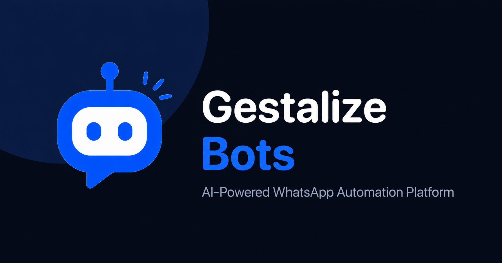
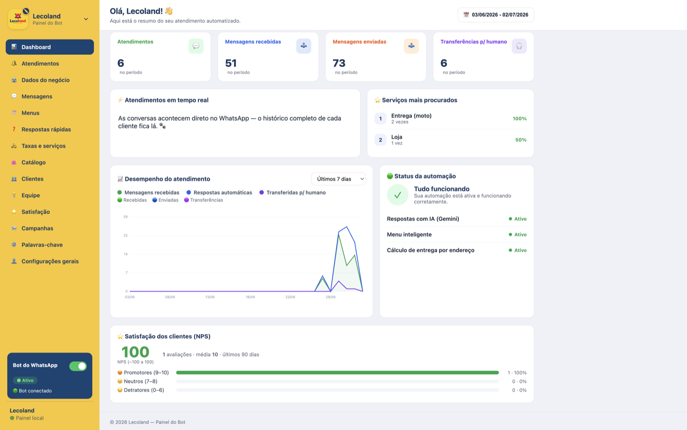
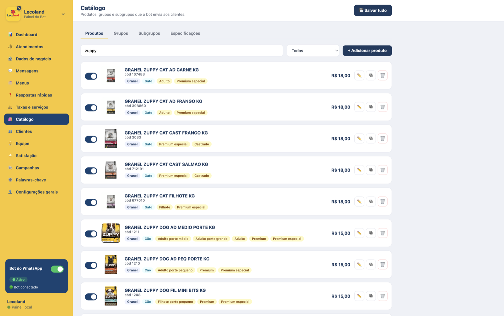
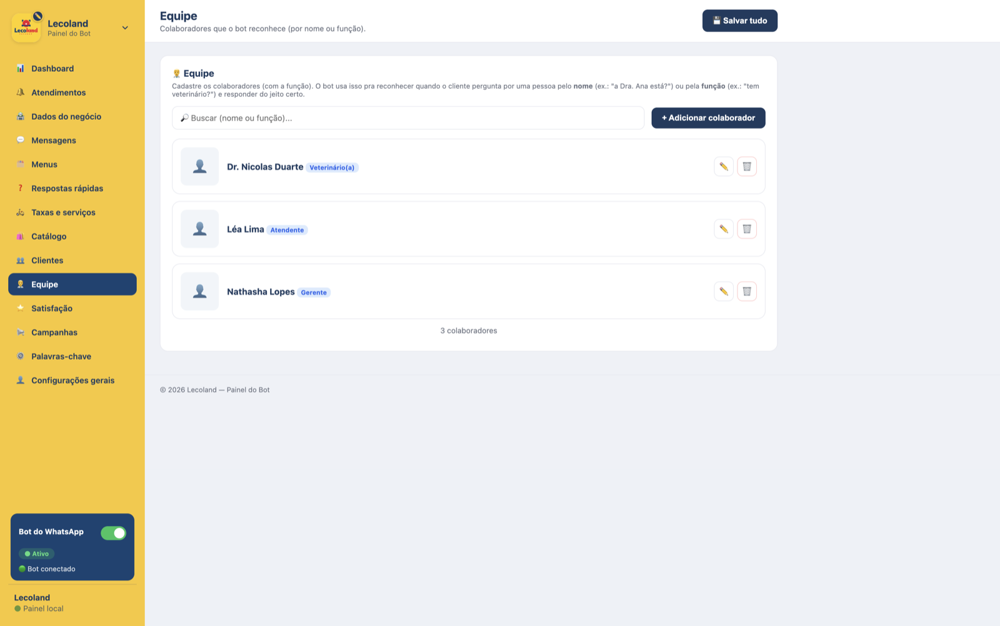
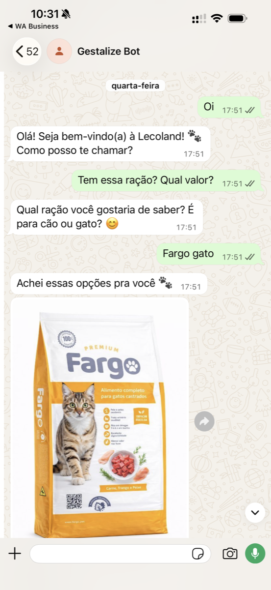

  

<h1 align="center">Gestalize Bots</h1>

  Intelligent Business Automation for WhatsApp

  Automate conversations, customer service, sales and business workflows using AI.

  
  
  

## Overview

Gestalize Bots is an AI-powered WhatsApp automation platform that enables businesses to automate customer communication, streamline support, qualify leads, manage conversations and integrate intelligent workflows into their daily operations.

Designed for organizations of all sizes, the platform combines conversational AI, business automation and a configurable administration panel, allowing non-technical teams to customize the entire customer experience without writing code.

## Business Problem

Businesses receive a high volume of repetitive customer requests every day through WhatsApp.

Questions about products, services, appointments, pricing, availability and support consume valuable staff time, increase response delays and often result in inconsistent customer experiences.

As organizations grow, maintaining fast, personalized and scalable communication becomes increasingly difficult without automation.

## Solution

Gestalize Bots provides an intelligent automation layer for WhatsApp that handles routine conversations, retrieves business information, executes predefined workflows and escalates complex requests to human operators whenever necessary.

The platform combines AI-powered conversations with configurable business rules, ensuring responses remain accurate, consistent and aligned with each organization's data and processes.

## Key Features

- Natural-language responses grounded in the business's configured data
- Keyword-based triage and guided, numbered menus
- Catalog and service management with search and image-based responses
- Location-based pricing and routing
- Customer CRM with custom records, tags and internal notes
- Intelligent human handoff with automatically generated conversation summaries
- Voice message transcription and document reading
- Product recognition from customer-submitted images
- Customer satisfaction surveys with reporting
- Broadcast campaigns to segmented audiences
- Operational metrics dashboard
- Business-hours and holiday awareness
- Team directory recognition
- Complete web administration panel, no code required

## Architecture Overview

Gestalize Bots is built around a modular architecture that separates messaging, business logic, artificial intelligence and administration into independent layers.

Incoming WhatsApp conversations are processed by the conversation engine, which combines configurable business rules with AI-powered responses to deliver accurate, context-aware interactions. When a request requires human intervention, the platform seamlessly transfers the conversation while preserving its context.

The administration panel allows organizations to manage business information, knowledge bases, products, services, workflows and AI behavior through an intuitive interface, eliminating the need for direct code changes.

This architecture enables the platform to remain scalable, maintainable and adaptable to different industries while keeping communication channels independent from the core business logic.

## Technology Stack

| Layer | Technology |
| --- | --- |
| Runtime | Node.js |
| Web framework | Express |
| Messaging | WhatsApp Cloud API |
| Natural language | Google Gemini |
| Geolocation and routing | OpenRouteService |
| Administration panel | Server-rendered HTML, CSS, and JavaScript |
| Persistence | File-based structured storage |

## Project Structure

At a high level, the codebase is organized into cohesive modules:

- Messaging integration — inbound webhook handling and outbound message delivery
- Conversation engine — triage, menus, dialog state, and human handoff
- AI service — grounded responses, catalog search, transcription, and document reading
- Administration panel — configuration interface and management endpoints
- Data layer — business configuration, product catalog, customer records, and analytics

## Screenshots

  
   
  <b>Administration dashboard</b>

<table>
  <tr>
    <td width="50%" align="center" valign="top">
      
       
      <b>Product catalog</b>
    </td>
    <td width="50%" align="center" valign="top">
      
       
      <b>Team management</b>
    </td>
  </tr>
</table>

  
   
  <b>WhatsApp conversation</b>

## Future Improvements

- Multi-language support
- Shared multi-agent inbox with assignment and routing
- Expanded analytics and reporting
- Additional third-party integrations
- Role-based access control for larger teams
- Multi-channel messaging support

## License

Gestalize Bots is proprietary software developed and maintained by Gestalize Systems. All rights reserved.
